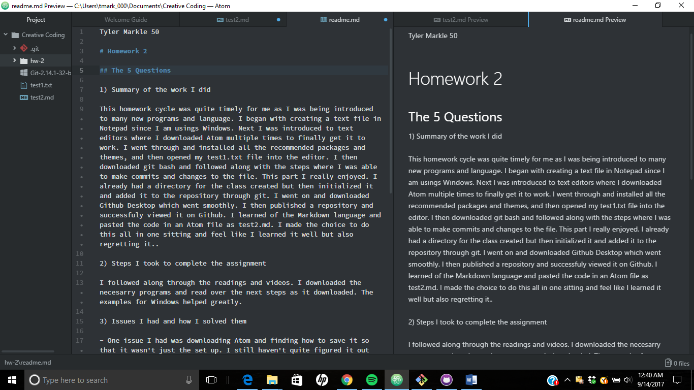

Tyler Markle 50

# Homework 2

## The 5 Questions

1) Summary of the work I did

This homework cycle was quite timely for me as I was being introduced to many new programs and language. I began with creating a text file in Notepad since I am usings Windows. Next I was introduced to text editors where I downloaded Atom multiple times to finally get it to work. I went through and installed all the recommended packages and themes, and then opened my test1.txt file into the editor. I then downloaded git bash and followed along with the steps where I was able to make commits and changes to the file. This part I really enjoyed. I already had a directory for the class created but then initialized it and added it to the repository through git. I went on and downloaded Github Desktop which went smoothly. I then published a repository and successfuly viewed it on Github. I learned of the Markdown language and pasted the code in an Atom file as test2.md. I made the choice to do this all in one sitting and feel like I learned it well but also regretting it..

2) Steps I took to complete the assignment

I followed along through the readings and videos. I downloaded the necesarry programs and read over the next steps as it downloaded. The examples for Windows helped greatly.

3) Issues I had and how I solved them

- One issue I had was downloading Atom and finding how to save it so that it wasn't just the set up. I still haven't quite figured it out but know that it still save all my work because I reopened it and everything was still there. Just took a lot of time.
- My other issue occured when I tried to open the repository in Atom through Github Desktop. When I cicked on repository there was no where that allowed me to open in Atom but I was still able to save it in Github. I did not post these to the issue board because I felt they would be too vague of questions and didn't know how to state my problem at the time.
- I did get some help by reading others comments on the issue that some had with Windows and it allowed me to find WindowsApps.

4) Things I would like to further discuss

Nothing at this time as I am still getting the hang of it all, although I did enjoy using Git Bash and seeing how that worked.

5) What issues did I help my classmates with

1. I was unable to help much as I got a late start and was struggling a bit myself.
2. I hope to be a greater help once I get the hang of each program and how they function.
3. This is an ordered list of how I was no help but plan to in the future.

[Here is a link to who will win the Super Bowl](http://www.raiders.com/)

``
Git init
Git Commit
``

