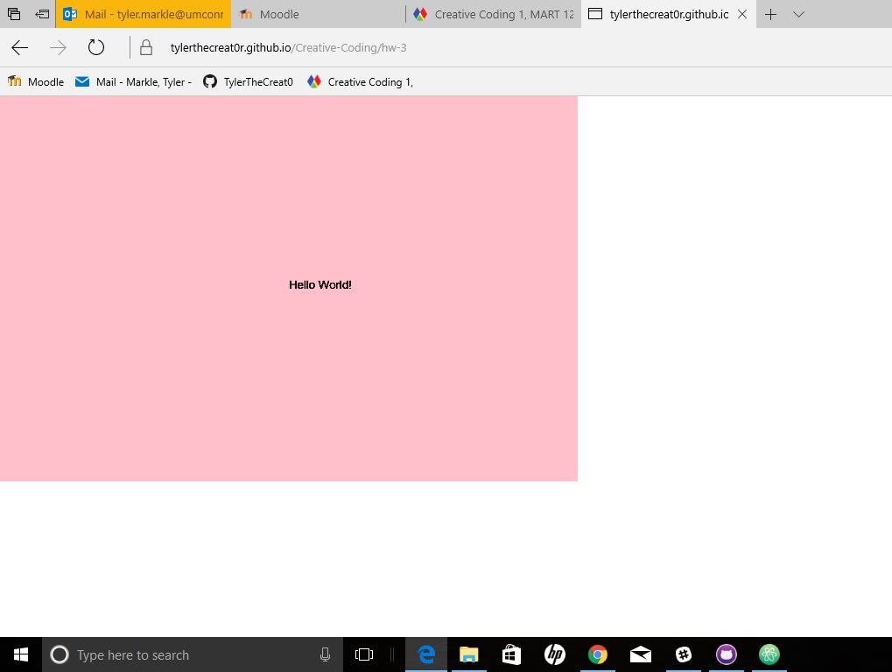

Tyler Markle, 50

["Hello World!"](https://tylerthecreat0r.github.io/Creative-Coding/hw-3/)

# HW-3 Response

This week I learned the basics of p5 and worked with creating a canvas. From there I really enjoyed writing the code (background and text functions) and then being able to open it up in a seperate browser to view.

Following along in the videos was crucial to my success in completing the assignment. The first problem I came across was having to install Atom again because I couldn't find it on my desktop or in the files. I found through google that this is a common issue with windows and found a solution where I just needed to check three boxes within the settings of Atom so that I can "open in Atom" from now on. The second issue I had was with the naming and duplicating of folders. I posted to the issue board and quickly realized that I just needed to close atom, rename it in explorer, and the push it through again to get my url to display my work. I am getting much more familiar with the works of atom, github, and github desktop which is very helpful. I am looking forward to next week!

## Final Sketch

This is an image of my final sketch

